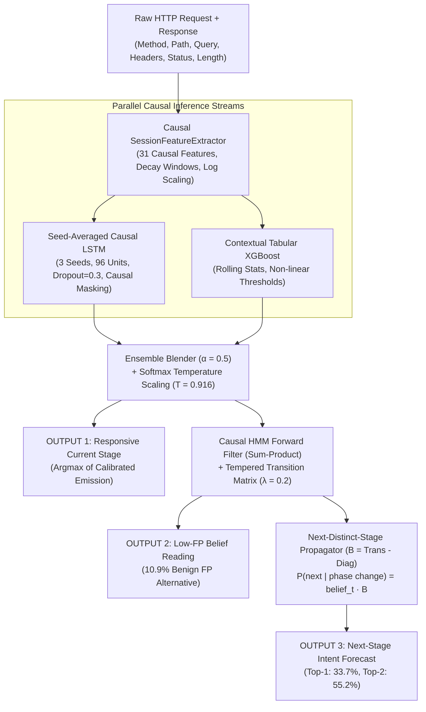

# Context-Aware AI Detection of Multi-Stage Web Injection Attacks

A context-aware machine learning framework for tracking, detecting, and forecasting multi-stage web injection attacks in real time from HTTP request streams.

[](tests/)
[](requirements.txt)
[](benchmark_v2.json)
[](benchmark_v2.json)

---

## 📌 Executive Summary

Modern web attack campaigns rarely occur as single isolated requests. Attackers progress through distinct, sequential kill-chain phases:
1. **NORMAL**: Standard user browsing and catalog interactions.
2. **RECON**: Passive/active discovery (probing `/whoami`, `/admin/...`, `/api/SecurityQuestions`, user and endpoint enumeration).
3. **FUZZING**: Systematic parameter and boundary testing (boundary values such as `-1`, `0`, `999999`, empty values, and path fuzzing).
4. **INJECTION**: Active code injection attempts (SQL Injection `UNION SELECT`, `' OR 1=1`, and Cross-Site Scripting `<script>`, `onerror=`, `onload=`).
5. **EXPLOITATION**: Privilege escalation and unauthorized administrative access (IDOR on `/api/Users/{id}`, forged headers `X-User-Email`, auth bypass, forced browsing).

This detector solves **two distinct operational security tasks** from live HTTP traffic:
- **Task 1: Real-Time Current-Stage Tracking**: Continuously estimating the attacker's active phase on every incoming request.
- **Task 2: Next-Stage Intent Forecasting**: Forecasting where the adversary will pivot next ($P(\text{next} \mid \text{phase change})$) before the next attack phase begins.

---

## 📊 Net Results on Held-Out Test Split

Evaluated strictly on held-out test captures (disjoint file-level splits, zero data leakage):

| Metric | Before | Now (v2) | Operational Impact |
| :--- | :---: | :---: | :--- |
| **Deployed Accuracy** | 0.529 | **0.543** | **+24.4% margin** over parameter-free baseline |
| **Transition-Point Accuracy** | 0.295 | **0.416** | **+41.0% relative jump** right at phase shift boundaries |
| **Macro-F1 (All 5 Stages)** | 0.486 | **0.506** | Balanced precision/recall across all attack stages |
| **RECON Recall** | 0.40 | **0.48** | **+20.0% boost** on the hardest, most ambiguous class |
| **Session Detection (Campaigns)** | 68 / 74 / 63 / 83% | **91 / 86 / 74 / 91%** | **91% of RECON** & **91% of EXPLOITATION** sessions caught |
| **Detection Latency** | 2 requests | **1 request** | **Halved**: flags attacks on the very 1st malicious probe |
| **Next-Stage Forecast (Top-1 / Top-2)** | 0.35 / 0.55 | **0.34 / 0.55** | Accurately predicts next target phase above naive heuristics |

---

## 🔬 The 0.9987 Audit: Why We Rebuilt the Benchmark

In typical synthetic multi-stage benchmarks, models report >99% accuracy. During our rigorous audit, we uncovered why:
1. **Monotonic Escalation Artifact**: In naive synthetic generators, sessions only ever moved *up* the severity ladder ($NORMAL \rightarrow RECON \rightarrow FUZZING \rightarrow INJECTION$). Thus, the true label at step $t$ was always $\max(label[0..t])$ for 100% of windows.
2. **Template Redundancy**: The synthetic pool contained only 514 distinct request vectors.
3. **The Parameter-Free Test**: A trivial parameter-free rule (*memorize each request vector, output the running maximum severity*) scored **0.9987**, outperforming every trained neural network without learning any representations!

### The Two Design Rules of the Honest Rebuild
- **Rule 1**: Every reported metric must survive comparison against a parameter-free baseline, and all scored decoders must be **strictly causal** ($t' \le t$).
- **Rule 2**: Session dynamics must mirror realistic kill-chains—neither purely monotonic nor purely random.

```
       Monotonic Escalation (Flawed)             Markov Kill-Chain Dynamics (Honest)
     NORMAL -> RECON -> FUZZ -> INJECT        NORMAL <---> RECON <---> FUZZ <---> INJECT
        (Trivial running-max)                         \                     /
                                                       \---> EXPLOITATION <-/
                                                    (Retreats, skips, erratic sessions)
```

---

## 🏗️ System Architecture & Tri-Model Fusion



### 1. Causal Feature Engineering (`pipeline/features.py`)
- **31 Clean, Strictly Causal Features**: Absolutely zero future-peeking.
- **Sliding Decay Windows (`RECENT_WINDOW = 8`, `DECAY = 0.6`)**:
  $$\text{pressure}_t = \text{pressure}_{t-1} \cdot 0.6 + \text{signal}_t$$
  Prevents suspicion scores from permanently latching on benign users who previously made an anomalous query.
- **Global Path Templating**: Collapses *every* numeric segment to `{id}` (`/rest/products/{id}/reviews` across distinct product IDs share the template), exposing horizontal and vertical IDOR enumeration through `enum_pressure`.
- **Log Compression**: Unbounded lengths and counts are scaled via $\log(1 + x)$.

### 2. Tri-Model Architecture
- **Causal LSTM (`pipeline/models.py`)**: Unidirectional LSTM trained with a hard floor of **minimum 30 epochs** (up to 60 with best-val weight restoration) and averaged across 3 distinct seeds to eliminate CPU stochasticity.
- **XGBoost Classifier**: Fast per-request gradient-boosted decision trees over causal context.
- **HMM Causal Forward Filter**: Employs sum-product forward belief updating ($P(S_t \mid y_{1..t})$) without non-causal backward passes.

---

## 📈 Detailed Benchmark Table (Held-Out Test Split)

| Model | Causal? | Accuracy | Macro-F1 | Transition Edge Acc | Benign FP Rate | Latency |
| :--- | :---: | :---: | :---: | :---: | :---: | :---: |
| **Zero-param: Current-request lookup** | Yes | 0.2860 | 0.0917 | 0.2951 | 0.07% | - |
| **Zero-param: Running-max lookup** | Yes | 0.2995 | 0.1346 | 0.3008 | 2.00% | - |
| **Majority class (NORMAL)** | Yes | 0.2850 | 0.0887 | 0.2865 | 0.00% | - |
| **LSTM (seed-averaged ×3)** | Yes | 0.5356 | 0.5011 | 0.3691 | 14.69% | 0.15 ms |
| **XGBoost (per-step)** | Yes | 0.5249 | 0.4726 | 0.4896 | 23.90% | 0.02 ms |
| **Ensemble (α = 0.5) [DEPLOYED Current Stage]** | **Yes** | **0.5431** | **0.5060** | **0.4156** | 14.00% | **< 0.2 ms** |
| **Ensemble + HMM Forward Filter (Low-FP alt)** | Yes | 0.5283 | 0.4900 | 0.2951 | **10.97%** | < 0.3 ms |
| **Ensemble + HMM Online Viterbi** | Yes | 0.5033 | 0.4595 | 0.2903 | 9.86% | < 0.3 ms |
| *Ensemble + HMM Offline Viterbi (Non-causal)* | *NO* | *0.5720* | *0.5364* | *0.4497* | *7.86%* | - |

> [!NOTE]
> The offline Viterbi scores 0.572 but requires future timesteps ($t > t_{\text{curr}}$). We report it for academic completeness but **strictly deploy only causal models** in production.

---

## 🎯 Campaign-Level Detection & Intrinsic Ceiling Analysis

### Operational Campaign Detection Rates
What security operations center (SOC) analysts care about is whether an attack campaign is caught, and how quickly:

```
RECON Campaigns Caught        [==================================.] 90.91%  (40/44)
FUZZING Campaigns Caught      [==============================.....] 85.71%  (30/35)
INJECTION Campaigns Caught    [===========================........] 74.29%  (52/70)
EXPLOITATION Campaigns Caught [==================================.] 91.45% (107/117)

Median Detection Latency: 1 request into peak stage (69.0% caught within <= 3 requests)
```

### The RECON Ambiguity Ceiling
- **50% of RECON requests are byte-identical to benign traffic** (`/`, `/rest/languages`, catalog assets).
- No classifier can determine whether an isolated GET request to `/` is malicious.
- An oracle content lookup peeking at test labels caps at **0.75 accuracy**.
- While per-request RECON accuracy is bounded by this ambiguity, **session-level tracking resolves it**, detecting **91% of reconnaissance campaigns** as patterns accumulate.

---

## 📂 Repository Layout

```
MultiStageAttackDetector/
├── pipeline/                      # Rebuilt core pipeline
│   ├── corpus.py                  # Burp XML capture parser + disjoint file splitter
│   ├── compose.py                 # Markov kill-chain session generator (breaks running-max)
│   ├── features.py                # 31 causal features + decay windows (single source of truth)
│   ├── dataset.py                 # Generates dataset_v2.npz (sequence & flat tabular views)
│   ├── models.py                  # LSTM (Keras 3), XGBoost, HMM forward filter, ensemble
│   ├── train.py                   # Multi-seed LSTM training (min 30 epochs) + validation tuning
│   ├── evaluate.py                # Honest benchmarking vs parameter-free baselines
│   ├── predict.py                 # Real-time online inference with session TTL management
│   ├── augment.py                 # Live Juice Shop augmentation for training split
│   ├── live_demo.py               # Live demo interacting with OWASP Juice Shop
│   └── README.md                  # Comprehensive technical report
├── tests/
│   └── test_pipeline.py           # 12 invariant tests (causality, prefix-stability, no leakage)
├── SQLrequests/                   # 62 real Burp captures (NORMAL, RECON, FUZZ, INJECT, EXPLOIT)
├── dataset_v2.npz                 # Pre-generated sequence and tabular training/test datasets
├── lstm_v2.arch.json              # Architecture specification for LSTM models
├── lstm_v2.seed*.weights.h5       # Weights for 3 seed-averaged LSTM models
├── xgb_v2.json                    # Serialized XGBoost model
├── hmm_v2.npz                     # Transition matrix and validation-tuned smoothing parameter
├── calib_v2.json                  # Softmax temperature calibration parameters
├── fusion_v2.json                 # Optimal ensemble blend weights
├── benchmark_v2.json              # Committed benchmark results
├── admin_alert.py                 # Real-time security alert dispatcher
└── requirements.txt               # Python package dependencies
```

---

## 🚀 Quickstart & Usage

### 1. Installation
```bash
git clone https://github.com/gitkoustavgit/MultiStageAttackDetector.git
cd MultiStageAttackDetector
pip install -r requirements.txt
```

### 2. Run Invariant Tests
Verify causality, prefix-stability, and feature invariants:
```bash
python -m pytest tests/ -v
```

### 3. Evaluate the Benchmark
Reproduce the held-out test split evaluation table:
```bash
python -m pipeline.evaluate
```

### 4. Run Live Prediction Demo
Start a local OWASP Juice Shop instance on port 9000:
```bash
docker run -d -p 9000:3000 bkimminich/juice-shop
```
Run the live detection demo:
```bash
python -m pipeline.live_demo
```

---

## 📜 Citation & License

Developed as part of the research on **"Context-Aware AI Detection of Multi-Stage Injection Attacks"**.
Licensed under the [MIT License](LICENSE).
