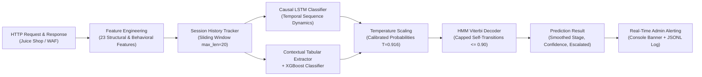

# Context-Aware AI Detection of Multi-Stage Web Injection Attacks

A context-aware machine learning framework for detecting, tracking, and alerting on multi-stage web injection attacks in real time from HTTP traffic sequences.

---

## 📌 Project Overview

Modern web attacks rarely occur as isolated, single-request events. Attackers progress through distinct, sequential kill-chain phases:
1. **NORMAL**: Standard user browsing and product interactions.
2. **RECON**: Passive and active reconnaissance (probing `/whoami`, `/ftp/`, `/languages`, `/api/Challenges/`).
3. **FUZZING**: Systematic parameter and boundary probing (testing boundary inputs such as `-1`, `0`, `999999`, and high endpoint probe diversity).
4. **INJECTION**: Active exploitation attempts targeting SQL Injection (SQLi) and Cross-Site Scripting (XSS).
5. **EXPLOITATION**: Privilege escalation and unauthorized administrative access (forged identity headers `X-User-Email`, forged JWTs, forced browsing to admin routes, and IDOR).

This project tracks in-progress user sessions, computes 23 structural and behavioral features per request, models temporal transitions using causal sequence architectures (**LSTM**, **HMM**, **XGBoost**, and **Hybrid models**), calibrates prediction confidences using temperature scaling, and immediately dispatches structured alerts to administrators upon detecting malicious behavior or stage escalation.

---

## 🏗️ System Architecture



### Key Technical Pillars

- **Dead Feature Elimination**: Active XSS payloads (`<script>`, `onerror=`, `javascript:`) injected alongside SQLi payloads, activating the previously zeroed `xss_indicator` across 13,500+ samples.
- **Strictly Causal Modeling**: The LSTM model is strictly forward-looking and unidirectional (no Bidirectional LSTM), ensuring offline benchmarks reflect real-world live traffic where future requests cannot be seen.
- **HMM Transition Smoothing without "Stickiness"**: Fitted transition matrix self-loops are capped at $\le 0.90$, resolving state lock-in while preserving sequence-level noise resilience.
- **Confidence Calibration**: Post-hoc Softmax Temperature Scaling ($T = 0.916$) reduces Expected Calibration Error (ECE) from $0.0070$ to $0.0058$.
- **Stratified Context Evaluation**: Models are transparently evaluated on thin context (target request #1–3 immediately following stage transitions) versus thick context (#10+).
- **Real-Time Admin Alerting**: Dispatches actionable security alerts (`INFO`, `LOW`, `WARNING`, `CRITICAL`) with attack details and mitigation advice.

---

## 📊 Benchmark & Evaluation Results

Evaluated on the held-out test split (1,580 windows across 75 test sessions):

| Model Architecture | Hyperparameters / Configuration | Accuracy | Macro F1 | Thin Context Acc (#1–3) | Thick Context Acc (#10+) | Inference Latency |
| :--- | :--- | :---: | :---: | :---: | :---: | :---: |
| **LSTM-Baseline** | `units=64, drop=0.3, lr=0.001` | 0.9639 | 0.9680 | 0.8400 | 0.9948 | 0.32 ms |
| **LSTM-Compact** | `units=32, drop=0.2, lr=0.001` | 0.9532 | 0.9560 | 0.8311 | 0.9854 | 0.90 ms |
| **LSTM-Deep (Best LSTM)** | **`units=128, drop=0.4, lr=0.0005`** | **0.9772** | **0.9795** | **0.8578** | **1.0000** | 0.39 ms |
| **LSTM-LowLR** | `units=64, drop=0.3, lr=0.0005` | 0.9753 | 0.9782 | 0.8667 | 1.0000 | 0.90 ms |
| **LSTM-Calibrated** | Softmax Temperature $T=0.916$ | **0.9772** | **0.9795** | 0.8578 | 1.0000 | 0.01 ms |
| **XGBoost-Fast** | `n_est=50, depth=4, lr=0.1` | 0.9918 | 0.9923 | 0.9467 | 1.0000 | 0.003 ms |
| **XGBoost-Default** | `n_est=100, depth=6, lr=0.1` | 0.9956 | 0.9959 | 0.9733 | 1.0000 | 0.005 ms |
| **XGBoost-Conservative (Best XGB)** | **`n_est=150, depth=6, lr=0.05`** | **0.9962** | **0.9964** | **0.9733** | **1.0000** | 0.005 ms |
| **XGBoost-Deep** | `n_est=100, depth=8, lr=0.1` | 0.9943 | 0.9948 | 0.9689 | 1.0000 | 0.004 ms |
| **HMM (Standalone GNB)** | Gaussian Naive Bayes emissions on request | 0.7703 | 0.7829 | 0.6444 | 0.8241 | 0.05 ms |
| **Hybrid: LSTM + Raw HMM** | Unconstrained transition self-loops ($\sim 0.99$) | 0.9475 | 0.9795 | 0.8578 | 1.0000 | 0.65 ms |
| **Hybrid: LSTM + Capped HMM** | **Capped self-loop at 0.90** | **0.9483** | **0.9795** | **0.8578** | **1.0000** | 0.65 ms |
| **Hybrid: XGBoost + HMM** | Capped self-loop at 0.90 | **0.9652** | **0.9964** | **0.9733** | **1.0000** | 0.55 ms |
| **Hybrid: Ensemble (LSTM+XGB)** | **50% LSTM + 50% XGBoost Soft Blend** | **0.9956** | **0.9960** | **0.9689** | **1.0000** | 1.10 ms |

Detailed per-class metrics and confusion matrices are saved in `benchmark_results.csv`.

---

## 📁 Repository Structure

```text
├── feature_engineering.py       # Single source of truth for 23 features & session tracking
├── upload_dataset.py            # Local Juice Shop synthetic multi-stage traffic generator
├── export_dataset.py            # MongoDB -> compact dataset.npz exporter
├── train_models.py              # Baseline LSTM and HMM training script
├── benchmark_models.py          # Unified benchmark suite (LSTM, HMM, XGBoost, Hybrids, Calibration)
├── live_predictor.py            # Online stream inference engine with Viterbi & Alert integration
├── admin_alert.py               # Real-time incident alert dispatcher & structured logger
├── predict_live_real.py         # Live end-to-end demo hitting local OWASP Juice Shop
├── dataset.npz                  # 10,000 window balanced multi-stage dataset
├── lstm_stage_classifier.keras  # Saved best LSTM model (units=128, drop=0.4, lr=5e-4)
├── hmm_params.npz               # Saved HMM transition matrix (capped at 0.90) & initial probs
├── xgboost_stage_classifier.json# Saved best XGBoost model (150 trees, depth 6)
├── calibration_params.json      # Optimal temperature scaling parameter (T=0.916)
├── benchmark_results.csv        # Detailed benchmark evaluation metrics
└── requirements.txt             # Python dependencies
```

---

## 🚀 Quickstart Guide

### 1. Requirements & Dependencies

Ensure Python 3.10+ is installed:

```bash
pip install -r requirements.txt
pip install xgboost
```

### 2. Start OWASP Juice Shop & MongoDB

Ensure Juice Shop is running on `http://localhost:9000` (e.g. via Docker or npm):

```bash
# Example Docker command:
docker run -d -p 9000:3000 bkimminich/juice-shop
```

Ensure local MongoDB is active on `mongodb://localhost:27017`.

### 3. Generate & Export Dataset

```bash
# 1. Generate 10,000 balanced requests across 5 phases and upload to MongoDB:
python upload_dataset.py

# 2. Export MongoDB records to local dataset.npz:
python export_dataset.py
```

### 4. Run Multi-Model Benchmarks

To reproduce the multi-parameter comparison across all architectures:

```bash
python benchmark_models.py
```

This trains the parameter sweeps, fits the temperature calibrator, builds the hybrid models, writes `benchmark_results.csv`, and saves the top models to disk.

### 5. Run Live Inference & Admin Alerting Demo

With Juice Shop running on `localhost:9000`, test real-time scoring and alerting:

```bash
python predict_live_real.py
```

#### Example Output:

```text
===============================================================================================
LIVE MULTI-STAGE INJECTION ATTACK DETECTOR & REAL-TIME ADMIN ALERTING
===============================================================================================
Loaded confidence calibration: Temperature T=0.916
req# lstm guess    viterbi guess   confidence  escalated  alert     resp_status/len
-----------------------------------------------------------------------------------------------
1    NORMAL        NORMAL          0.614       False      None      200/9393
2    NORMAL        NORMAL          0.838       False      None      200/921
3    RECON         RECON           0.998       True       ALERT!    200/11
4    RECON         RECON           0.813       False      None      200/703
5    FUZZING       FUZZING         1.000       True       ALERT!    200/30
6    INJECTION     INJECTION       0.997       True       ALERT!    500/533
7    INJECTION     INJECTION       1.000       False      ALERT!    500/381
8    INJECTION     INJECTION       0.952       False      ALERT!    200/23577
-----------------------------------------------------------------------------------------------
Demo complete. Total Alerts Triggered & Logged to admin_alerts.jsonl: 5
```

All triggered alerts are stored in `admin_alerts.jsonl` (structured JSON audit log) and `admin_alerts.log` (plain text incident log).

---
